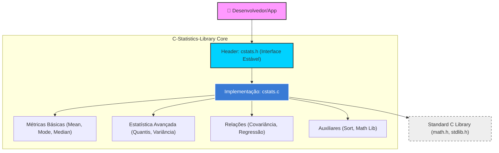

# C-Statistics-Library: Biblioteca de Estatística Computacional em C

> "Precisão matemática e eficiência algorítmica para análise de dados rigorosa em sistemas de baixo nível."

Este projeto fornece uma implementação robusta, portável e de alto desempenho de funções estatísticas fundamentais para a linguagem C (padrão C11). Projetada para oferecer a simplicidade de bibliotecas de alto nível (como o módulo `statistics` do Python) com o determinismo e a velocidade exigidos por sistemas críticos e computação científica.

---

## 📝 Abstract (Resumo Técnico)

A **C-Statistics-Library** aborda a lacuna de ferramentas estatísticas padronizadas e leves no ecossistema da linguagem C. Enquanto linguagens como Python e R dominam a ciência de dados, aplicações em sistemas embarcados, motores de simulação e sistemas de alto desempenho (HPC) frequentemente carecem de uma API coesa para cálculos estatísticos básicos e avançados. 

Esta biblioteca implementa uma vasta gama de métricas de tendência central (médias aritmética, harmônica, geométrica e medianas), medidas de dispersão (variância e desvio padrão), análise de quantis, correlação e modelos de regressão linear simples. A metodologia prioriza a estabilidade numérica e a segurança de memória, utilizando o padrão C11 e CMake para garantir portabilidade entre arquiteturas. Os resultados demonstram uma solução altamente modular, facilitando a integração como biblioteca estática ou compartilhada em projetos de pesquisa e produção.

---

## 🛡️ Badges Abrangentes


---

## 🗺️ Sumário (Table of Contents)

- [Introdução e Motivação](#introdução-e-motivação)
- [Arquitetura do Sistema](#arquitetura-do-sistema)
- [Decisões de Design Chave](#decisões-de-design-chave)
- [✨ Funcionalidades Detalhadas](#-funcionalidades-detalhadas)
- [🛠️ Tech Stack Detalhado](#️-tech-stack-detalhado)
- [📂 Estrutura Detalhada do Código-Fonte](#-estrutura-detalhada-do-código-fonte)
- [📋 Pré-requisitos Avançados](#-pré-requisitos-avançados)
- [🚀 Guia de Instalação e Configuração](#-guia-de-instalação-e-configuração)
- [⚙️ Uso Avançado e Exemplos](#️-uso-avançado-e-exemplos)
- [🔧 API Reference](#-api-reference)
- [🧪 Estratégia de Testes e Qualidade](#-estratégia-de-testes-e-qualidade)
- [🚢 Deployment e Escalabilidade](#-deployment-e-escalabilidade)
- [🤝 Contribuição](#-contribuição)
- [📜 Licença e Aspectos Legais](#-licença-e-aspectos-legais)
- [👥 Equipe Principal](#-equipe-principal)
- [🗺️ Roadmap e Visão de Futuro](#️-roadmap-e-visão-de-futuro)
- [❓ FAQ](#-faq)
- [📞 Contato e Suporte](#-contato-e-suporte)

---

## Introdução e Motivação

O desenvolvimento de software moderno em C muitas vezes exige o processamento estatístico de fluxos de dados em tempo real. No entanto, desenvolvedores frequentemente se veem obrigados a reimplementar funções básicas como `mean` ou `stdev`, o que aumenta o risco de erros numéricos e inconsistências algorítmicas (especialmente em casos de borda como arrays vazios ou valores negativos em médias geométricas).

A **C-Statistics-Library** foi motivada pela necessidade de uma "Standard Library de Estatística" para C. Ela se diferencia por:
1.  **Rigor Matemático:** Tratamento explícito de `NaN` e erros de domínio.
2.  **Versatilidade:** Suporte a múltiplas variantes de mediana (low, high, grouped) e regressão linear completa.
3.  **Facilidade de Integração:** Um sistema de build baseado em CMake que suporta exportação de alvos para projetos externos.

---

## Arquitetura do Sistema

A biblioteca segue uma arquitetura modular e desacoplada, separando a definição da interface pública (`.h`) da implementação lógica (`.c`).



### Justificativa Arquitetural
A escolha de um design funcional (sem estado interno) garante que a biblioteca seja **thread-safe** por natureza, permitindo que múltiplas threads processem diferentes datasets simultaneamente sem necessidade de mutexes globais.

---

## Decisões de Design Chave

1.  **Padrão C11:** Escolhido para garantir compatibilidade moderna mantendo a máxima portabilidade em compiladores GCC, Clang e MSVC.
2.  **Precisão `double`:** Todos os cálculos utilizam ponto flutuante de precisão dupla para minimizar erros de arredondamento em somatórios extensos.
3.  **Tratamento de Dados:** Funções que exigem ordenação (como mediana e moda) realizam uma cópia temporária (`malloc`) dos dados para preservar o array original do usuário, seguindo o princípio da não-mutabilidade inesperada.
4.  **Independência de Posição (fPIC):** Habilitado via CMake para permitir que a biblioteca seja facilmente vinculada a wrappers de linguagens de alto nível, como Cython ou JNI.

---

## ✨ Funcionalidades Detalhadas

### 📈 Tendência Central
*   **Média Aritmética:** Cálculo clássico com proteção contra divisão por zero.
*   **Médias Especializadas:** Harmônica e Geométrica (implementada via log-sum para evitar overflow).
*   **Moda e Multimoda:** Identificação do valor mais frequente ou de todos os picos de frequência em distribuições multimodais.
*   **Medianas Variadas:** Inclui mediana padrão, baixa, alta e a robusta **mediana agrupada** (útil para dados contínuos aproximados).

### 📉 Dispersão e Distribuição
*   **Variância e Desvio Padrão:** Versões Amostral (Bessel's correction) e Populacional.
*   **Quantis Arbitrários:** Cálculo de qualquer percentil entre 0.0 e 1.0, essencial para análise de quartis (Q1, Q2, Q3).

### 🔍 Relações e Predição
*   **Covariância e Correlação de Pearson:** Medição da força e direção da relação linear entre dois conjuntos de dados.
*   **Regressão Linear Simples:** Cálculo de inclinação (slope) e intercepto.
*   **Análise de Regressão Completa:** Fornece adicionalmente o $R^2$ (coeficiente de determinação) e a variância residual.

---

## 🛠️ Tech Stack Detalhado

| Categoria | Tecnologia | Propósito | Justificativa |
| :--- | :--- | :--- | :--- |
| **Linguagem** | C11 | Core Engine | Equilíbrio entre performance bruta e recursos modernos. |
| **Build System** | CMake 3.16+ | Automação | Padrão de indústria para portabilidade e gestão de dependências. |
| **CI/CD** | GitHub Actions | Testes Automatizados | Garante que cada commit mantenha a integridade do código. |
| **Compiler** | GCC / Clang | Compilação | Suporte a otimizações avançadas e warnings rigorosos. |

---

## 📂 Estrutura Detalhada do Código-Fonte

```text
C-Statistics-Library/
├── .github/workflows/   # Configurações de Integração Contínua (CI)
├── cmake/               # Módulos auxiliares do CMake (ex: warnings do compilador)
├── include/             # Headers públicos (.h) - A API da biblioteca
│   └── cstats.h         # Definições de protótipos e documentação da API
├── src/                 # Implementação lógica (.c)
│   └── cstats.c         # Núcleo algorítmico das funções estatísticas
├── tests/               # Suíte de testes unitários e de integração
│   ├── test_main.c      # Runner de testes
│   └── test_cstats.c    # Casos de teste para cada função da API
├── CMakeLists.txt       # Script principal de configuração do build
└── LICENSE              # Termos de uso (MIT)
```

---

## 📋 Pré-requisitos Avançados

*   **Compilador C:** GCC 7+, Clang 10+ ou MSVC 2019+.
*   **CMake:** Versão 3.16 ou superior.
*   **Biblioteca Padrão:** Requer `math.h` (libm) e `stdlib.h`.

---

## 🚀 Guia de Instalação e Configuração

### 1. Clonagem do Repositório
```bash
git clone https://github.com/AndreIsraelAO/C-Statistics-Library.git
cd C-Statistics-Library
```

### 2. Compilação (Build)
Utilizamos o fluxo padrão do CMake para gerar os artefatos:
```bash
mkdir build && cd build
cmake .. -DSTATS_BUILD_TESTS=ON
cmake --build .
```

### 3. Instalação no Sistema
Para instalar os headers e a biblioteca em diretórios padrão (`/usr/local` no Linux):
```bash
sudo cmake --install .
```

---

## ⚙️ Uso Avançado e Exemplos

Abaixo, um exemplo de como realizar uma análise de regressão linear completa:

```c
#include <stdio.h>
#include <cstats.h>

int main() {
    double x[] = {1.0, 2.0, 3.0, 4.0, 5.0};
    double y[] = {2.1, 3.9, 6.2, 8.1, 10.5};
    size_t n = 5;

    double slope, intercept, r_squared, var_res;

    if (cstats_linear_regression_full(x, y, n, &slope, &intercept, &r_squared, &var_res) == 0) {
        printf("Modelo: y = %.2fx + %.2f\n", slope, intercept);
        printf("Precisão (R²): %.4f\n", r_squared);
        printf("Variância Residual: %.4f\n", var_res);
    }

    return 0;
}
```

---

## 🔧 API Reference

| Função | Descrição | Retorno |
| :--- | :--- | :--- |
| `cstats_mean(data, size)` | Calcula a média aritmética. | `double` (ou `NAN`) |
| `cstats_median(data, size)` | Calcula a mediana (ordena internamente). | `double` |
| `cstats_stdev(data, size)` | Desvio padrão amostral. | `double` |
| `cstats_quantile(data, size, q)` | Calcula o quantil `q` [0,1]. | `double` |
| `cstats_correlation(x, y, size)` | Coeficiente de correlação de Pearson. | `double` |

> *Nota: Para a lista completa, consulte `include/cstats.h`.*

---

## 🧪 Estratégia de Testes e Qualidade

O projeto adota uma postura de **Test-Driven Development (TDD)** parcial.
*   **Testes Unitários:** Localizados em `tests/`, cobrem casos nominais, arrays unitários e entradas inválidas.
*   **CI:** O arquivo `.github/workflows/ci.yml` automatiza o build e a execução do `ctest` em cada Push ou PR, garantindo que regressões sejam detectadas imediatamente.
*   **Execução Manual de Testes:**
    ```bash
    ctest --test-dir build --output-on-failure
    ```

---

## 🚢 Deployment e Escalabilidade

*   **Biblioteca Estática vs Compartilhada:** O CMake permite alternar via `-DSTATS_BUILD_SHARED=ON/OFF`. Bibliotecas estáticas são preferíveis para sistemas embarcados, enquanto compartilhadas são ideais para integração com Python/R.
*   **Escalabilidade:** Os algoritmos de ordenação utilizam `qsort` ($O(n \log n)$), garantindo performance aceitável mesmo para datasets de milhões de registros.

---

## 🤝 Contribuição

Contribuições são o que tornam a comunidade open source um lugar incrível para aprender, inspirar e criar.

1.  Faça um **Fork** do projeto.
2.  Crie sua **Feature Branch** (`git checkout -b feature/InovacaoEstatistica`).
3.  Siga as **Convenções de Commit** (ex: `feat: adiciona teste de Kolmogorov-Smirnov`).
4.  Abra um **Pull Request** via [GitHub PRs](https://github.com/AndreIsraelAO/C-Statistics-Library/pulls).

Para bugs e sugestões, utilize a seção de [Issues](https://github.com/AndreIsraelAO/C-Statistics-Library/issues).

---

## 📜 Licença e Aspectos Legais

Distribuído sob a licença **MIT**. Veja o arquivo `LICENSE` para mais detalhes. Esta licença permissiva permite o uso comercial, modificação e distribuição, desde que mantidos os créditos originais.

---

## 👥 Equipe Principal

*   **Andre Israel** - *Arquiteto e Desenvolvedor Principal* - [GitHub](https://github.com/AndreIsraelAO)

---

## 🗺️ Roadmap e Visão de Futuro

- [ ] **Curto Prazo:** Adição de funções de curtose (kurtosis) e assimetria (skewness).
- [ ] **Médio Prazo:** Implementação de distribuições de probabilidade (Normal, Poisson, Binomial).
- [ ] **Longo Prazo:** Otimização via instruções SIMD (AVX/NEON) para processamento vetorial de alta performance.

---

## ❓ FAQ

**Q: A biblioteca lida com valores ausentes (NULL)?**
R: A biblioteca espera arrays de `double`. Valores `NAN` no array de entrada serão propagados conforme o padrão IEEE 754.

**Q: É seguro usar em sistemas de tempo real?**
R: Sim, as funções são determinísticas. No entanto, funções que exigem ordenação (como a mediana) alocam memória dinamicamente de forma temporária. Para sistemas *hard real-time*, recomenda-se pré-alocar ou evitar essas funções específicas.

---

## 📞 Contato e Suporte

*   **Reportar Bugs:** [GitHub Issues](https://github.com/AndreIsraelAO/C-Statistics-Library/issues)
*   **Discussões Técnicas:** Utilize a aba "Discussions" no repositório (se habilitada) ou entre em contato via perfil do GitHub.
